# Entity Relationship Diagram

```mermaid
erDiagram
    USERS ||--o| BUSINESSES : owns
    BUSINESSES ||--o{ OFFERS : has
    OFFERS ||--o{ OFFER_SLOTS : contains
    OFFER_SLOTS ||--o{ BOOKINGS : receives
    OFFERS ||--o{ BOOKINGS : references
    OFFER_SLOTS ||--o{ WAITLIST_ENTRIES : has
    BOOKINGS ||--o{ NOTIFICATION_LOGS : triggers

    USERS {
        uuid id PK
        string email UK
        string password_hash
        string role
        timestamptz created_at
        timestamptz updated_at
    }

    BUSINESSES {
        uuid id PK
        uuid user_id FK
        string business_name
        string business_type
        string owner_name
        string phone_number
        string email
        string address
        string city
        string logo_url
        time opening_time
        time closing_time
        timestamptz created_at
        timestamptz updated_at
    }

    OFFERS {
        uuid id PK
        uuid business_id FK
        string title
        text description
        string category
        decimal original_price
        decimal offer_price
        decimal discount_percentage
        date start_date
        date end_date
        time start_time
        time end_time
        int total_capacity
        int max_booking_per_customer
        text terms_and_conditions
        string status
        timestamptz created_at
        timestamptz updated_at
    }

    OFFER_SLOTS {
        uuid id PK
        uuid offer_id FK
        date slot_date
        time start_time
        time end_time
        int capacity
        int booked_count
        string status
        timestamptz created_at
        timestamptz updated_at
    }

    BOOKINGS {
        uuid id PK
        uuid offer_id FK
        uuid slot_id FK
        string reference UK
        string customer_name
        string phone_number
        string email
        int number_of_people
        text special_note
        string status
        string payment_status
        string coupon_code
        string cancellation_token
        string qr_code_data
        timestamptz created_at
        timestamptz updated_at
    }

    WAITLIST_ENTRIES {
        uuid id PK
        uuid slot_id FK
        string customer_name
        string phone_number
        string email
        int number_of_people
        string status
        timestamptz created_at
    }

    NOTIFICATION_LOGS {
        uuid id PK
        uuid booking_id FK
        string channel
        string recipient
        string subject
        text body
        string status
        timestamptz created_at
    }

    COUPONS {
        uuid id PK
        uuid offer_id FK
        string code UK
        decimal discount_amount
        decimal discount_percent
        int max_uses
        int used_count
        date valid_from
        date valid_to
        bool is_active
    }
```

## Relationships

- **User → Business**: 1:1 (admin owns one business profile)
- **Business → Offers**: 1:N
- **Offer → OfferSlots**: 1:N
- **OfferSlot → Bookings**: 1:N
- **Offer → Bookings**: denormalized FK for queries
- **Booking → NotificationLogs**: 1:N (mock SMS/email)
